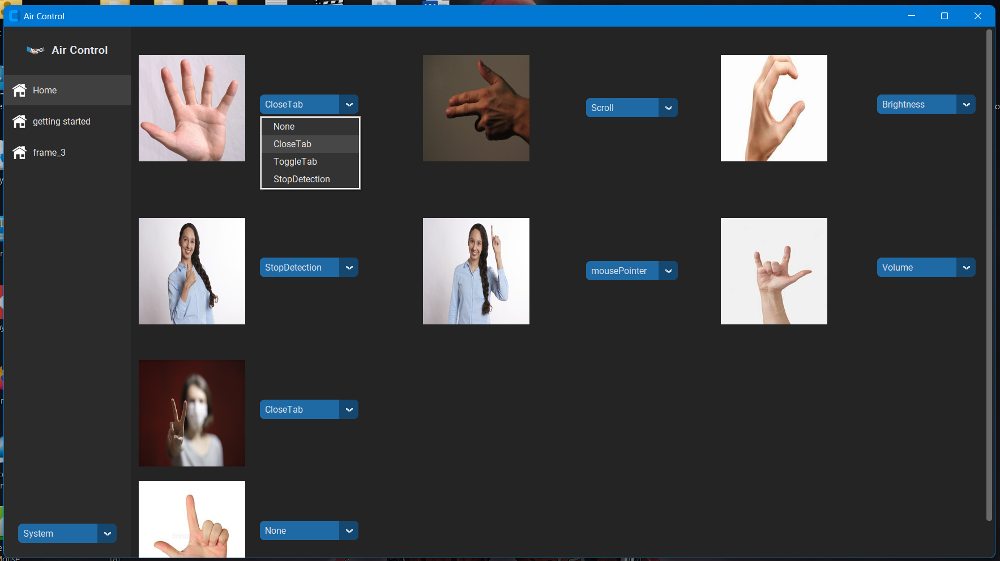

# Air Controle

Air Controle is a complete software that allows you to controle your laptop using just your hand gestures.
This python software uses [Mediapipe](https://developers.google.com/mediapipe).

- [HandGesture.py](https://shields.io/)
  This python library can be used in any projects. it uses handgesture recognition algorithms and returns the recognised hand gesture, so you can use this to make your own projects.
- [perform_task_code.py](https://shields.io/)
  This python code uses the recognised gesture and then performs the task according to settings.
- [Gui_testing_GR.py](https://shields.io/)
  This code is to create GUI in [Customtkinter](https://shields.io/). From this UI user can set tasks for each handgesture.

## Downloads

You can download installable software from here:

## How to use??
See this tutorial vedio...

## Authors

- [@ArpitMourya](https://github.com/ArpitMourya)
- [@Yashdeep kumrawat](https://github.com/YashdeepKum)

